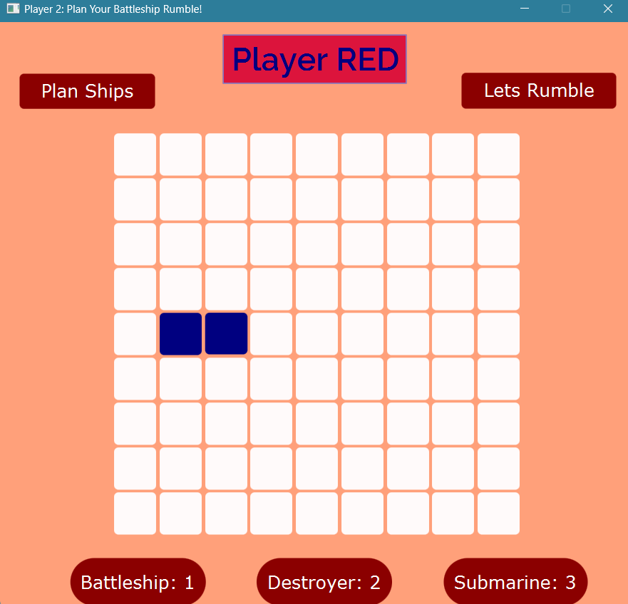

# Battleship Guessing Game

Welcome to the Battleship Guessing Game! This application is developed using JavaFX and SceneBuilder, offering a two-player experience of the classic Battleship game. Strategically place your pieces and outmaneuver your opponent to win.

## Features

- **Two-Player Mode**: Play against another player, each with your own grid.
- **Piece Placement**: Strategically place your battleship, destroyers, and submarines on a 9x9 grid.
- **Turn-Based Gameplay**: Take turns firing shots to hit and destroy your opponent's pieces.
- **Dynamic Feedback**: Receive immediate feedback on your shots, indicating hits and misses.
- **Winning Condition**: The first player to destroy all opponent pieces wins the game.

## Game Pieces

- **Battleship**: Occupies 3 grid squares.
- **Destroyers**: Each occupies 2 grid squares.
- **Submarines**: Each occupies 1 grid square.

## Installation

To get started, follow these steps:

1. **Clone the Repository**:
   ```bash
   https://github.com/aaakloo-waiting/BattleShip_Guessing_Game_JavaFx-.git
2. **Install JavaFx**
   You may use any IDE(IntelliJ IDEA or Eclipse) to setup Java environment(Download all required external libraries for Javafx). Add your database executable file as external library of project. (May use MySQL database for easy access)
3. **Setup JDK**
   From the "Project Structure", make sure to add oracle openJDK(version 21 or higher preferable) .jar file as dependency and load the gui project. Compile and Run it at the backend of your othe programs and enjoy your productive session!

## How to Play

1. **Setup Phase**:
   - Each player places their pieces (1 battleship, 2 destroyers, and 3 submarines) on their 9x9 grid.
   - Pieces cannot overlap and must fit entirely within the grid.

2. **Gameplay Phase**:
   - Players take turns to target a grid square on the opponent's board.
   - A hit is marked when a shot targets an occupied square; otherwise, it is a miss.
   - A piece is destroyed once all its occupied squares are hit.

3. **Winning the Game**:
   - The game continues until one player destroys all the opponent's pieces.

## Screenshot

<p align="center">
  
   <br/>
  <em>Main Menu</em>
   <br/>
  
   <br/>
  <em>Ship planning-i</em>
   <br/>
</p>

<p align="center">
  
   <br/>
  <em>Ship planning-ii</em>
   <br/>
  
   <br/>
  <em>Rumble on!</em>
   <br/>
</p>


